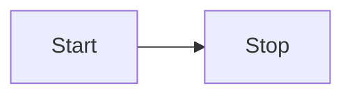

如果您想更改 Markdown 文档在阅读视图中的呈现方式，您可以添加您自己的_Markdown 后处理器_。正如名称所示，后处理器在 Markdown 被处理为 HTML 之后运行。它允许您向呈现的文档添加、删除或替换 [HTML elements](../User%20interface/HTML%20elements.md)。

以下示例查找包含两个冒号“:”之间的文本的任何代码块，并将其替换为适当的表情符号：

```ts
import { Plugin } from 'obsidian';

const ALL_EMOJIS: Record<string, string> = {
  ':+1:': '👍',
  ':sunglasses:': '😎',
  ':smile:': '😄',
};

export default class ExamplePlugin extends Plugin {
  async onload() {
    this.registerMarkdownPostProcessor((element, context) => {
      const codeblocks = element.findAll('code');

      for (let codeblock of codeblocks) {
        const text = codeblock.innerText.trim();
        if (text[0] === ':' && text[text.length - 1] === ':') {
          const emojiEl = codeblock.createSpan({
            text: ALL_EMOJIS[text] ?? text,
          });
          codeblock.replaceWith(emojiEl);
        }
      }
    });
  }
}
```

## 后处理 Markdown 代码块

您是否知道，您可以通过创建具有如下文本定义的“mermaid”代码块来在 Obsidian 中创建 [Mermaid](https://mermaid-js.github.io/) 图表？：

````md
```美人鱼
流程图LR
    开始-->停止
```
````

如果更改为预览模式，代码块中的文本将变为下图：



如果您想添加自己的自定义代码块（例如 Mermaid 代码块），可以使用 [registerMarkdownCodeBlockProcessor()](../../Reference/TypeScript%20API/Plugin/registerMarkdownCodeBlockProcessor.md)。以下示例将包含 CSV 数据的代码块呈现为表格：

```ts
import { Plugin } from 'obsidian';

export default class ExamplePlugin extends Plugin {
  async onload() {
    this.registerMarkdownCodeBlockProcessor('csv', (source, el, ctx) => {
      const rows = source.split('\n').filter((row) => row.length > 0);

      const table = el.createEl('table');
      const body = table.createEl('tbody');

      for (let i = 0; i < rows.length; i++) {
        const cols = rows[i].split(',');

        const row = body.createEl('tr');

        for (let j = 0; j < cols.length; j++) {
          row.createEl('td', { text: cols[j] });
        }
      }
    });
  }
}
```
