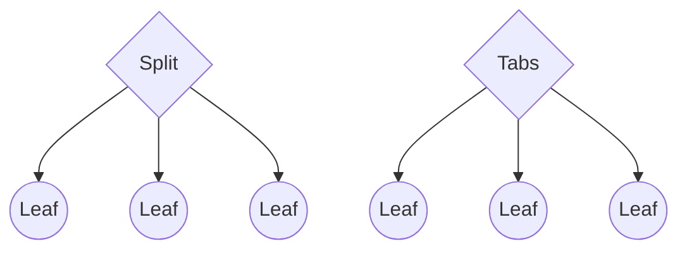
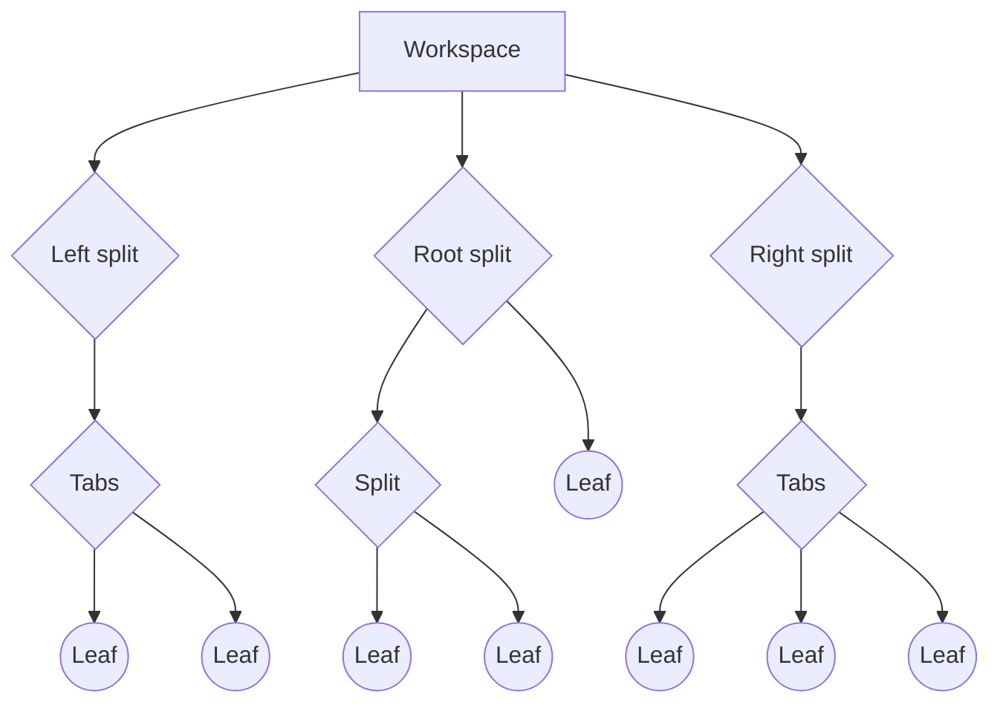
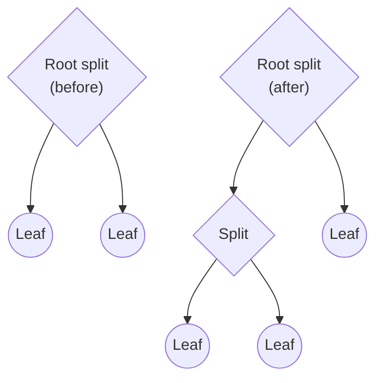
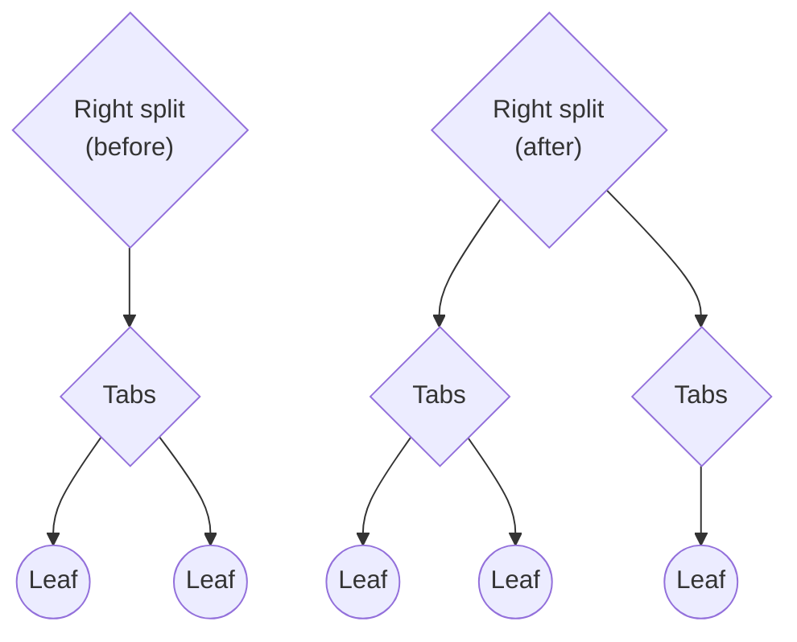

Obsidian 允许您配置在任何给定时间您可以看到哪些内容。不需要时隐藏文件资源管理器，并排显示多个文档，或在处理文档时显示文档的大纲。应用程序窗口中可见内容的配置称为_工作空间_。

工作区以[树形数据结构](https://en.wikipedia.org/wiki/Tree_(data_struction)) 的形式实现，其中树中的每个节点都称为 [[WorkspaceItem|workspace item]]。工作区项目有两种类型：[[WorkspaceParent|parents]] 和 [[WorkspaceLeaf|leaves]]。主要区别在于父项可以包含 _child_ 项，包括其他父项，而叶项根本不能包含任何工作区项。

有两种类型的父项：[[WorkspaceSplit|splits]] 和 [[WorkspaceTabs|tabs]]，它们决定子项如何呈现给用户：



- 拆分项目沿垂直或水平方向一个接一个地布置其子项目。
- 选项卡项目一次仅显示一个子项目并隐藏其他项目。

工作区下面有三个特殊的分割项：_left_、_right_ 和_root_。下图显示了典型工作区的示例：



叶子是一个可以以不同方式显示内容的窗口。叶子的类型决定了内容的显示方式，并对应于特定的_view_。例如，“graph”类型的叶子显示[图形视图](https://help.obsidian.md/Plugins/Graph+view)。

## 分裂

默认情况下，根分割的方向设置为垂直。当您为其创建新叶时，Obsidian 会在用户界面中创建一个新列。当您分割叶子时，生成的叶子将添加到新的分割项中。虽然在根分割下可以创建的级别数量没有明确的限制，但实际上，每个级别的有用性都会减弱。



左右分割的工作方式略有不同。当您在侧面停靠区中分割叶子时，Obsidian 会生成一个新的选项卡项目并在其下方添加新叶子。实际上，这意味着它们在任何时候只能拥有三个级别的工作区项目，并且任何直接子项都必须是选项卡项目。



## 检查工作区

您可以通过 [[App|App]] 对象访问工作区。以下示例打印工作区中每个叶子的类型：

```ts
import { Plugin } from 'obsidian';

export default class ExamplePlugin extends Plugin {
  async onload() {
    this.addRibbonIcon('dice', 'Print leaf types', () => {
      this.app.workspace.iterateAllLeaves((leaf) => {
        console.log(leaf.getViewState().type);
      });
    });
  }
}
```

## 叶子生命周期

插件可以将任何类型的叶子添加到工作区，以及通过[[Views|custom views]]定义新的叶子类型。以下是向工作区添加叶子的几种方法。如需了解更多信息，请参阅[[Reference/TypeScript API/Workspace|Workspace]]。

- 如果您想在根分割中添加新叶子，请使用[[getLeaf|getLeaf(true)]]。
- 如果您想在任何侧栏中添加新的叶子，请使用[[getLeftLeaf|getLeftLeaf()]]和[[getRightLeaf|getRightLeaf()]]。两者都可以让您决定是否将叶子添加到新的分割中。

您还可以使用 [[createLeafInParent|createLeafInParent()]] 在您选择的拆分中显式添加叶子。

除非明确删除，否则即使插件被禁用，插件添加到工作区的任何叶子仍然保留。插件负责删除它们添加到工作区的任何叶子。

要从工作区中删除叶子，请对要删除的叶子调用 [[detach|detach()]]。您还可以使用 [[detachLeavesOfType|detachLeavesOfType()]] 删除特定类型的所有叶子。

## 叶组

您可以使用 [[setGroup|setGroup()]] 将多个叶分配给同一组来创建[链接视图](https://help.obsidian.md/User+interface/Tabs#Linked+views)。

```ts
leaves.forEach((leaf) => leaf.setGroup('group1');
```
